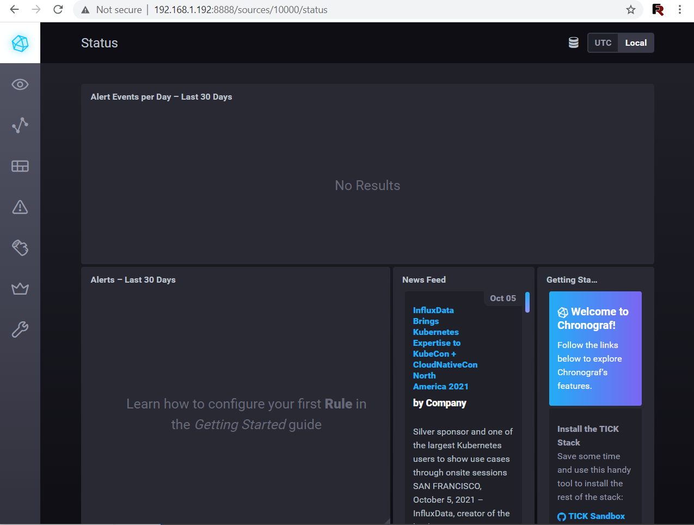
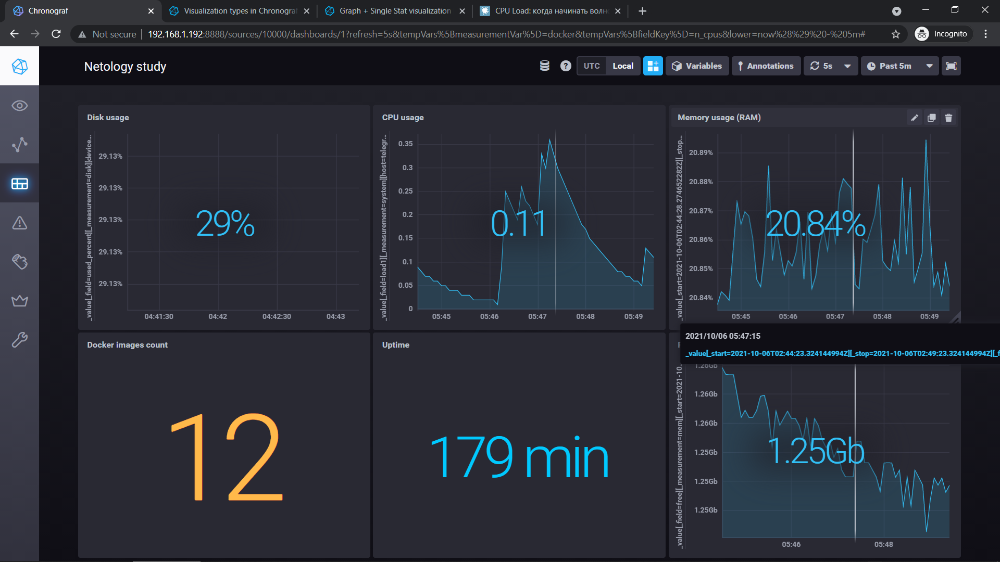

# Домашнее задание к занятию "10.02. Системы мониторинга"

> 1. Опишите основные плюсы и минусы pull и push систем мониторинга.

В случае pull модели сбор метрик/логов инициирует система мониторинга. В случае push модели хосты (агенты) передают метрику/логи в систему пониторинга.  
Плюса pull модели:  
- Легче контролировать подлинность данных
- Можно настроить единый proxy-server до всех агентов с TLS
- Упрощенная отладка получения данных с агентов
- Упрощённая настойка или отсутствие необходимости настроки агента (хоста)

Минусы pull модели: 
- Ограничены или отсутствуют взможножности обработки информации на стороне клиента

Плюсы push модели:
- Упрощение репликации данных в разные системы мониторинга или их резервные копии 
- Более гибкая настройка отправки пакетов данных с  метриками
- UDP является менее затратным способом передачи данных, вследствии чего может вырости производительность сбора метри

Минусы push модели:  
- Требуется разворачивание и настройка клиента на агенте
- Система мониторинга может находиться за firewall и потребует дополнительной настройки правил маршрутизации

> 2. Какие из ниже перечисленных систем относятся к push модели, а какие к pull? А может есть гибридные?

Система мониторинга  | Тип модели
--- | ---
Prometheus | Pull
VictoriaMetrics | Pull
TICK | Push
Zabbix | Гибрид
VictoriaMetrics | Гибрид
Nagios | Pull

> 3. Склонируйте себе [репозиторий](https://github.com/influxdata/sandbox/tree/master) и запустите TICK-стэк, 
используя технологии docker и docker-compose.

```bash
devops@frcloud2:~/TICK/sandbox$ curl -i http://localhost:8086/ping
HTTP/1.1 204 No Content
Content-Type: application/json
Request-Id: d74ceec0-2614-11ec-8047-0242ac120002
X-Influxdb-Build: OSS
X-Influxdb-Version: 1.8.9
X-Request-Id: d74ceec0-2614-11ec-8047-0242ac120002
Date: Tue, 05 Oct 2021 19:45:49 GMT

```

```bash
curl http://localhost:8888
<!DOCTYPE html><html><head><meta http-equiv="Content-type" content="text/html; charset=utf-8"><title>Chronograf</title><link rel="icon shortcut" href="/favicon.fa749080.ico"><link rel="stylesheet" href="/src.d80ed715.css"></head><body> <div id="react-root" data-basepath=""></div> <script src="/src.c278d833.js"></script> </body></html>
```

```bash
 curl -i http://localhost:9092/kapacitor/v1/ping
HTTP/1.1 204 No Content
Content-Type: application/json; charset=utf-8
Request-Id: e310569f-2618-11ec-8244-000000000000
X-Kapacitor-Version: 1.6.2
Date: Tue, 05 Oct 2021 20:14:47 GMT

```

> А также скриншот веб-интерфейса ПО chronograf (`http://localhost:8888`). 



> 4. Перейдите в веб-интерфейс Chronograf (`http://localhost:8888`) и откройте вкладку `Data explorer`.  
> 5. Изучите список [telegraf inputs](https://github.com/influxdata/telegraf/tree/master/plugins/inputs). 

<pre>
В веб-интерфейсе откройте вкладку `Dashboards`. Попробуйте создать свой dashboard с отображением:
    - утилизации ЦПУ
    - количества использованного RAM
    - утилизации пространства на дисках
    - количество поднятых контейнеров
    - аптайм
</pre>



