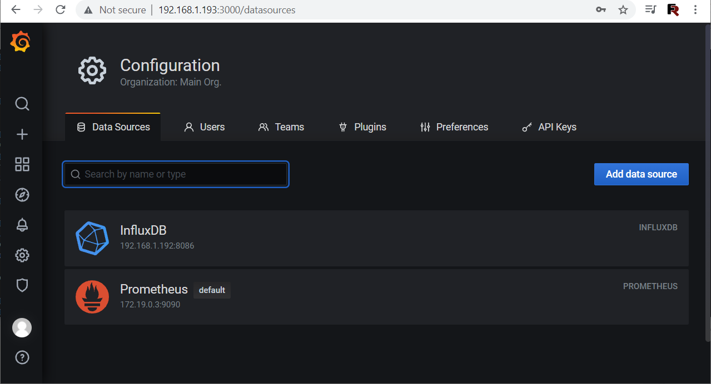
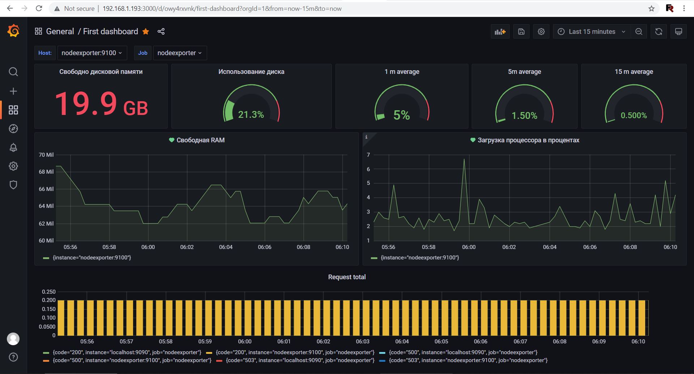
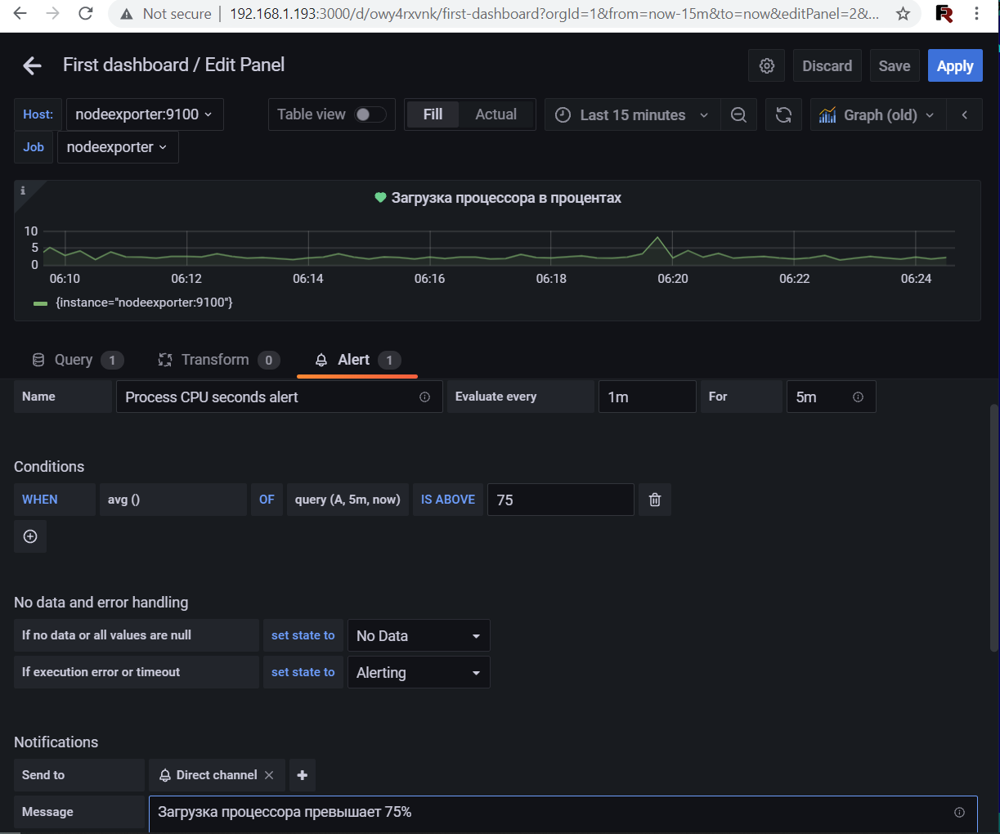

# Домашнее задание к занятию "10.03. Grafana"

## Задание повышенной сложности

**В части задания 1** не используйте директорию [help](./help) для сборки проекта, самостоятельно разверните grafana, где в 
роли источника данных будет выступать prometheus, а сборщиком данных node-exporter:
- grafana
- prometheus-server
- prometheus node-exporter

За дополнительными материалами, вы можете обратиться в официальную документацию grafana и prometheus.

В решении к домашнему заданию приведите также все конфигурации/скрипты/манифесты, которые вы 
использовали в процессе решения задания.

**В части задания 3** вы должны самостоятельно завести удобный для вас канал нотификации, например Telegram или Email
и отправить туда тестовые события.

В решении приведите скриншоты тестовых событий из каналов нотификаций.

## Обязательные задания

### Задание 1

Решение домашнего задания - скриншот веб-интерфейса grafana со списком подключенных Datasource.




## Задание 2
Изучите самостоятельно ресурсы:
- [promql-for-humans](https://timber.io/blog/promql-for-humans/#cpu-usage-by-instance)
- [understanding prometheus cpu metrics](https://www.robustperception.io/understanding-machine-cpu-usage)

Создайте Dashboard и в ней создайте следующие Panels:
- Утилизация CPU для nodeexporter (в процентах, 100-idle)
```
100 - (avg by (instance) (irate(node_cpu_seconds_total{mode="idle"}[5m])) * 100)
```
- CPULA 1/5/15
```
avg(node_load1{instance="$node",job="$job"}) /  count(count(node_cpu_seconds_total{instance="$node",job="$job"}) by (cpu)) * 100

avg(node_load5{instance="$node",job="$job"}) /  count(count(node_cpu_seconds_total{instance="$node",job="$job"}) by (cpu)) * 100

avg(node_load15{instance="$node",job="$job"}) /  count(count(node_cpu_seconds_total{instance="$node",job="$job"}) by (cpu)) * 100
```
- Количество свободной оперативной памяти
```
avg by (instance) (rate(node_memory_MemFree_bytes[1h]))
```

- Количество места на файловой системе
```
irate(node_filesystem_avail_bytes{mountpoint="/",fstype!="rootfs"}[30m])/(1024*1024)

100 - ((node_filesystem_avail_bytes{mountpoint="/",fstype!="rootfs"} * 100) / node_filesystem_size_bytes{mountpoint="/",fstype!="rootfs"})
```



## Задание 3
Итоговая дашборд на предыдущем скриншоте, на следующем скриншоте показан Alert для случая, когда загрузка процессора поднимается до 75%. Alert протестирован и он послал два сообщения в Discord - при прервышении нагрузки было послано сообщение Alert и сообщение OK когда нагрузка упала ниже 75%. 




## Задание 4
Сохранённый Dashboard - [NetologyDashboard.json](./NetologyDashboard.json)

---
