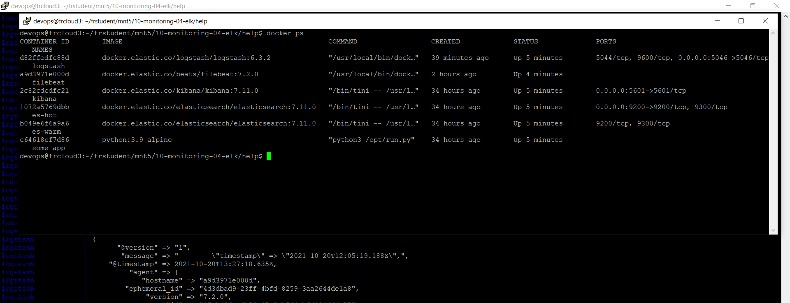

# Домашнее задание к занятию "10.04. ELK"

<!--
## Дополнительные ссылки

При выполнении задания пользуйтесь вспомогательными ресурсами:

- [поднимаем elk в докер](https://www.elastic.co/guide/en/elastic-stack-get-started/current/get-started-docker.html)
- [поднимаем elk в докер с filebeat и докер логами](https://www.sarulabs.com/post/5/2019-08-12/sending-docker-logs-to-elasticsearch-and-kibana-with-filebeat.html)
- [конфигурируем logstash](https://www.elastic.co/guide/en/logstash/current/configuration.html)
- [плагины filter для logstash](https://www.elastic.co/guide/en/logstash/current/filter-plugins.html)
- [конфигурируем filebeat](https://www.elastic.co/guide/en/beats/libbeat/5.3/config-file-format.html)
- [привязываем индексы из elastic в kibana](https://www.elastic.co/guide/en/kibana/current/index-patterns.html)
- [как просматривать логи в kibana](https://www.elastic.co/guide/en/kibana/current/discover.html)
- [решение ошибки increase vm.max_map_count elasticsearch](https://stackoverflow.com/questions/42889241/how-to-increase-vm-max-map-count)

В процессе выполнения задания могут возникнуть также не указанные тут проблемы в зависимости от системы.

Используйте output stdout filebeat/kibana и api elasticsearch для изучения корня проблемы и ее устранения.

## Задание повышенной сложности

Не используйте директорию [help](./help) при выполнении домашнего задания.

-->

## Задание 1

Поднятие сервиса даже при использовании docker-compose оказалось задачей с сюпризом.
- elasticsearch(hot и warm ноды)
- logstash
- kibana
- filebeat

В условии задания было сказано подождать 5 минут, но поднятая инфраструктура столь долго не жила.
Поиск по логам указал на источник проблемы:
<pre>
es-hot              | ERROR: [1] bootstrap checks failed
es-hot              | [1]: max virtual memory areas vm.max_map_count [65530] is too low, increase to at least [262144]
es-hot              | ERROR: Elasticsearch did not exit normally - check the logs at /usr/share/elasticsearch/logs/es-docker-cluster.log
e</pre>

Соответственно, контейнер kibana не мог синхронизироваться с elastic нодой со всемы вытекающими последствиями. Решение нашлось быстро и оно показано ниже:

```bash
sysctl -w vm.max_map_count=262144
```

Следующая проблема возникла с filebeat
<pre>
filebeat            | Exiting: error loading config file: config file ("filebeat.yml") must be owned by the user identifier (uid=0) or root
filebeat exited with code 1
</pre>

Эта проблема решилась крайне просто:
```bash
sudo chown root filebeat.yml
```

Следующая проблема с filebeat
<pre>
filebeat            | {"level":"info","timestamp":"2021-10-20T11:32:58.284Z","caller":"pipeline/output.go:93","message":"Attempting to reconnect to backoff(async(tcp://logstash:5046)) with 11 reconnect attempt(s)"}
filebeat            | {"level":"warn","timestamp":"2021-10-20T11:33:00.900Z","caller":"transport/tcp.go:53","message":"DNS lookup failure \"logstash\": lookup logstash on 127.0.0.11:53: no such host"}
</pre>

Причина найдена - из контейнера filebeat хост logstash не пингуется. При это logstash пингуется из контейнера kibana. Проблема решается добавлением в docker-compose.yml в параметры контейнра filebeat: 
```yaml
    networks:
      - elastic
 ```
 Упс. Это лишь решает проблему сети, но в логах теперь другая ошибка:
 <pre>
 filebeat            | {"level":"error","timestamp":"2021-10-20T12:05:43.868Z","caller":"pipeline/output.go:100","message":"Failed to connect to backoff(async(tcp://logstash:5046)): dial tcp 172.19.0.4:5046: connect: connection refused"}
</pre>
 
 При этом фрагмент лога logstash
 <pre>
logstash            | [2021-10-20T12:25:49,496][INFO ][org.logstash.beats.Server] Starting server on port: 5044
 </pre>

Ага. Похоже что он слушает на порту 5044 вместо 5046.
И тут я пошёл по неправильному пути - поднял API на порту 5046 и получил следующую ошибку протокола. Теперь стало понятно что надо было изменять порт в конфигурации filebeat.yml, а не в logstash.yml. После смены порта filebeat заработал.

> Logstash следует сконфигурировать для приёма по tcp json сообщений.  
> Filebeat следует сконфигурировать для отправки логов docker вашей системы в logstash.  

Пришлось это сделать чтобы запустить.

> В директории [help](./help) находится манифест docker-compose и конфигурации filebeat/logstash для быстрого 
выполнения данного задания.

Было бы удивительно, если бы достаточно было его запустить. 

- скриншот `docker ps` через 5 минут после старта всех контейнеров (их должно быть 5)



- скриншот интерфейса kibana


## Задание 2

>Перейдите в меню [создания index-patterns  в kibana](http://localhost:5601/app/management/kibana/indexPatterns/create)
и создайте несколько index-patterns из имеющихся.

И вот тут началось самое интересное. Дело в том, что ничего этого не получилось сделать без включенной авторизации. Пришлось основательно углубиться в поиск.

Первым делом пришлось настроить SSL аутентификацию, потому что версия 7.11 требует только SSL для корректной работы. Здесь очень погла следующая инструкция - https://codingfundas.com/setting-up-elasticsearch-6-8-with-kibana-and-x-pack-security-enabled/index.html Но этого оказалось мало и пришлось добирать информацию по этой ссылке - https://discuss.elastic.co/t/set-password-and-user-with-docker-compose/225075 

И вот здесь внезапно у меня возник вопрос к преподавателю:

```yaml
filebeat.inputs:
  - type: container
    paths:
      - '/var/lib/docker/containers/*/*.log'
```
С учётом того, что контейнеров за время обучения накопилось порядочное количество, с учётом того, что формат логов варьируется от классического syslogd до логов в формате JSON, с учётом того, что контейнеры ELK в процессе работы продолжают писать логи в /var/lib/docker/containers/\*/\*.log (если не фильтровать), с учётом всех этих факторов, когда десятки мегабайты логов и логи продолжают генерировать логи, очень мощному серверу на на многопроцессорном Xeon и RAID из SSD,  внезапно "попхолело". Конечно я не весь сервер использую, а лишь некоторые ресурсы вирутальной машины, которую мне любезно предоставили на работе. Это специально так задумано - обучение "по бразильской системе"? Пока я ненадолго отошёл от компьютера, файл лога контейнера logstash вырос на несколько десяткоы гигабайт. Хороший урок я получил.


> Перейдите в меню просмотра логов в kibana (Discover) и самостоятельно изучите как отображаются логи и как производить 
поиск по логам.


Собственно с этого момента и началось выполнение домашнего задания. 

1. Прежде всего пришось модифицировать run.py чтобы он писал в лог в классическом формате syslog.
2. Поменять настройки filebeat чтобы он игнорировал строки, которые не формате syslog,
3. Замапить локальную директорию в /var/log котнейнеров filebeat и some_application
4. Настроить logstash на разборр формата syslog путём использования grok.
5. Настроить создание индексов в logstash
6. Вероятно я что-то забыл, поскольку выполнение задания заняло очень много времени.

Вероятно, выполнение задания значительно бы упростилось, если делать его пошагам - сначала настроить logstash на локальные логи, затем перейти к filebeat, а уже затем писать тестовое приложение, генерирующее log.

Все файлы, созданные и модифицированные во время задания помещены в этот репозиторий. Они ни в коем случае не могут использоваться для образца, поскольку содержат множество закоммениторованых параметров, которые использововались при попытке настроить ELK.
