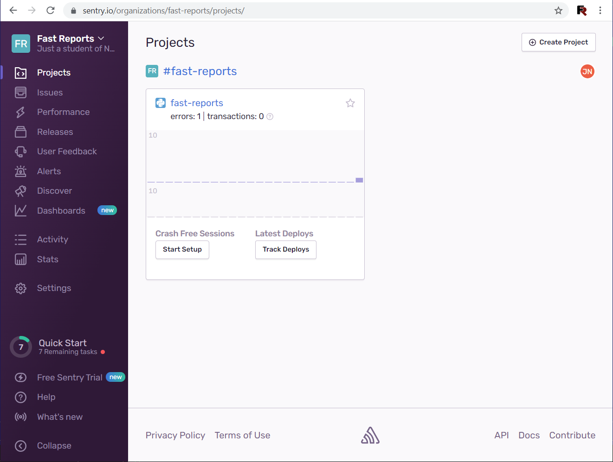
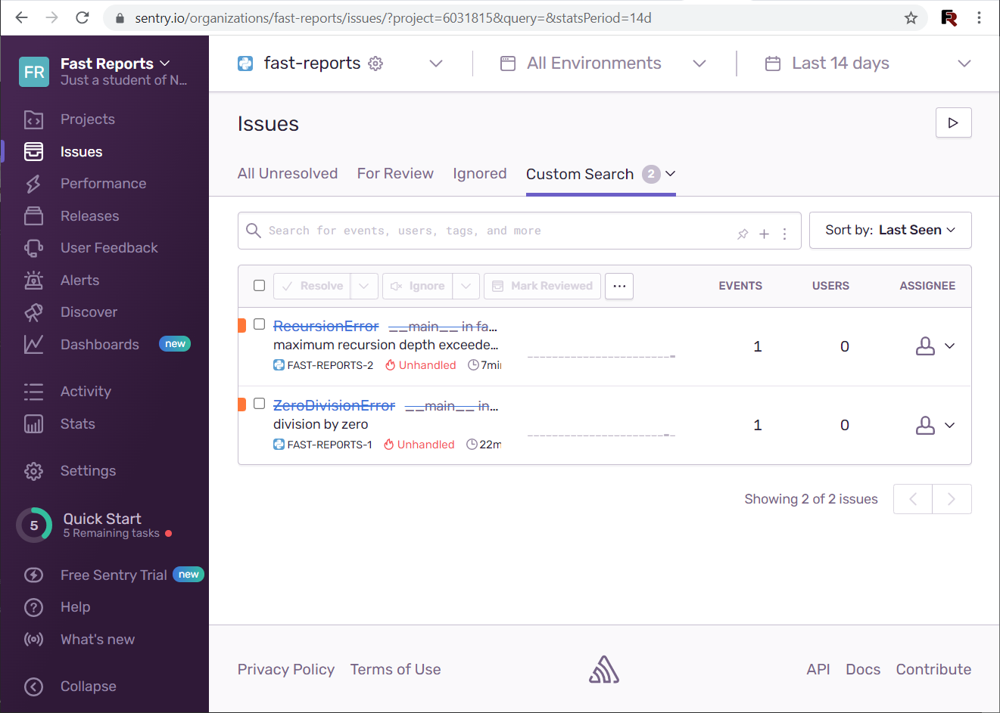
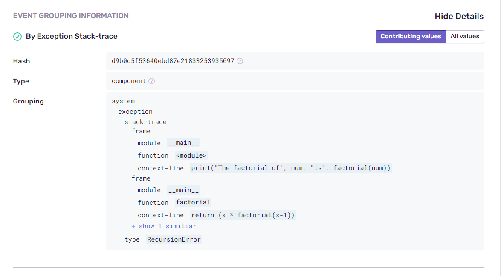
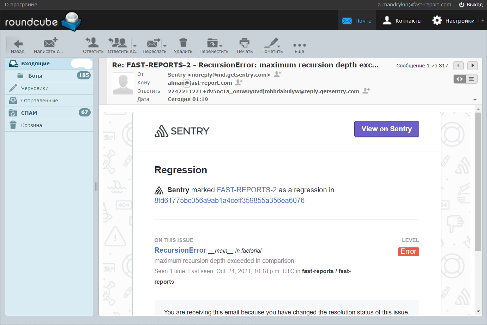

# Домашнее задание к занятию "10.05. Sentry"

## Задание 1

## Задание 2

Пример программы с ошибкой - [study_sentry.py](./study_sentry.py)

Переполнение стэка - https://sentry.io/share/issue/9fa5e04ff8e54217848ed781caca1a5d/

Деление на ноль - https://sentry.io/share/issue/608e30d1484e4eaa86c0c3a51c22b2af/

> Для выполнения задание предоставьте скриншот `Stack trace` из этого события и список событий проекта, 
после нажатия `Resolved`.

## Задание 3

